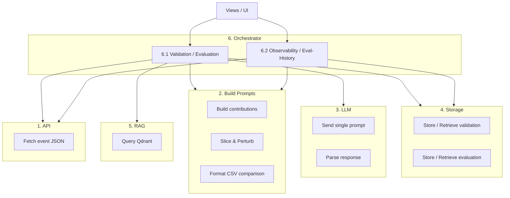

# Validation Studio — Compartment Architecture

The system is organized into **6 compartments**, each with a clear boundary and contract. A compartment may span multiple files, but its inputs/outputs are well-defined.

---

## 1. API Compartment

**Purpose**: Fetch full event JSON from the Bill TS API. Pure I/O, no transformation.

| Step | Action | File(s) |
|------|--------|---------|
| 1.1 | Receive an event ID | — (input contract) |
| 1.2 | Call Bill TS API to get the full JSON event | [bill-api.ts](file:///home/maxencetlm/Bill-LLM-EndVal/validation-studio/src/lib/api/bill-api.ts) |
| 1.3 | Return the raw JSON event | — (output contract) |

**Input**: `eventId: number`  
**Output**: `any` — full event JSON

---

## 2. Build Prompts Compartment

**Purpose**: Transform raw event JSON + config into ready-to-send prompts. Pure data transformation — no I/O.

| Step | Action | File(s) |
|------|--------|---------|
| 2.1 | Receive target event JSON, similar event JSONs, `config`, optional `perturbationStrategy` | — (input contract) |
| 2.2 | Build contributions (extract module-specific data from each event JSON) | [module-contribution.ts](file:///home/maxencetlm/Bill-LLM-EndVal/validation-studio/src/lib/validation/module-contribution.ts), [data-preparation.ts](file:///home/maxencetlm/Bill-LLM-EndVal/validation-studio/src/lib/validation/orchestrator-modules/data-preparation.ts) |
| 2.3 | Apply slicing (if < 100%) and perturbations (if strategy provided) | [prompt-processor.ts](file:///home/maxencetlm/Bill-LLM-EndVal/validation-studio/src/lib/validation/orchestrator-modules/prompt-processor.ts), [perturbation-engine.ts](file:///home/maxencetlm/Bill-LLM-EndVal/validation-studio/src/lib/validation/perturbation-engine.ts) |
| 2.4 | Format data into side-by-side CSV comparison table | [format_csv_comparison.ts](file:///home/maxencetlm/Bill-LLM-EndVal/validation-studio/src/lib/validation/format_csv_comparison.ts) |
| 2.5 | Assemble prompt using template | [prompt-builder.ts](file:///home/maxencetlm/Bill-LLM-EndVal/validation-studio/src/lib/validation/prompt-builder.ts) |
| 2.6 | Return, for each module, a prompt or list of prompts | [shared-prompt-pipeline.ts](file:///home/maxencetlm/Bill-LLM-EndVal/validation-studio/src/lib/validation/shared-prompt-pipeline.ts) |

**Input**: `{ targetEvent: JSON, similarEvents: JSON[], config, perturbationStrategy? }`  
**Output**: `Record<module, prompt | prompt[]>`

---

## 3. LLM Compartment

**Purpose**: Send a single prompt to the LLM and return its output. Stateless and reusable.

| Step | Action | File(s) |
|------|--------|---------|
| 3.1 | Receive **one prompt** (not a list) and a config (`model`, `temperature`) | — (input contract) |
| 3.2 | Send prompt to LLM API with tool-call schema + retry/fallback logic | [llm-client.ts](file:///home/maxencetlm/Bill-LLM-EndVal/validation-studio/src/lib/validation/llm-client.ts) |
| 3.3 | Parse tool-call response, return structured output | [llm-client.ts](file:///home/maxencetlm/Bill-LLM-EndVal/validation-studio/src/lib/validation/llm-client.ts) |

**Input**: `{ prompt: string, config: { model, temperature } }`  
**Output**: `Issue[]` — parsed list of detected issues (path, severity, message, suggestion)

---

## 4. Storage Compartment

**Purpose**: Persist and retrieve validation/evaluation history.

| Operation | Storage File | File(s) |
|-----------|-------------|---------|
| **Core Storage Logic** | — | [result-storage.ts](file:///home/maxencetlm/Bill-LLM-EndVal/validation-studio/src/lib/validation/orchestrator-modules/result-storage.ts) |
| **Type Definitions** | — | [storage-core.ts](file:///home/maxencetlm/Bill-LLM-EndVal/validation-studio/src/lib/configuration/storage-core.ts) |
| **Validation History API** | `data/validation_history.json` | [api/observability/route.ts](file:///home/maxencetlm/Bill-LLM-EndVal/validation-studio/src/app/api/observability/route.ts) |
| **Evaluation History API** | `data/evaluation_history.json` | [api/evaluation/route.ts](file:///home/maxencetlm/Bill-LLM-EndVal/validation-studio/src/app/api/evaluation/route.ts) |

---

## 5. RAG Compartment

**Purpose**: Find similar events via vector search.

| Step | Action | File(s) |
|------|--------|---------|
| 5.1 | Receive an event ID | — (input contract) |
| 5.2 | Query Qdrant database to find 4 similar event IDs | [retrieval-service.ts](file:///home/maxencetlm/Bill-LLM-EndVal/validation-studio/src/lib/validation/orchestrator-modules/retrieval-service.ts) |
| 5.3 | Return the `int[]` list of similar IDs | — (output contract) |

**Input**: `eventId: number`  
**Output**: `number[]` — list of similar event IDs

---

## 6. Orchestrator Compartment

**Purpose**: Wire compartments together. Has **2 processes**.

### 6.1 Validation / Evaluation Process

Triggered by the user clicking "Start Validation" or "Run Evaluation".

| Step | Action | Calls | File(s) |
|------|--------|-------|---------|
| 6.1.1 | Receive `eventId`, `config`, optional `perturbationStrategy` from the UI | — | [api/evaluation/run/route.ts](file:///home/maxencetlm/Bill-LLM-EndVal/validation-studio/src/app/api/evaluation/run/route.ts) |
| 6.1.2 | Call **RAG** → get similar IDs | Compartment 5 | [validation-orchestrator.ts](file:///home/maxencetlm/Bill-LLM-EndVal/validation-studio/src/lib/validation/validation-orchestrator.ts) |
| 6.1.3 | Call **API** → fetch target + similar event JSONs | Compartment 1 | [validation-orchestrator.ts](file:///home/maxencetlm/Bill-LLM-EndVal/validation-studio/src/lib/validation/validation-orchestrator.ts) |
| 6.1.4 | Call **Build Prompts** → get prompts per module | Compartment 2 | [validation-orchestrator.ts](file:///home/maxencetlm/Bill-LLM-EndVal/validation-studio/src/lib/validation/validation-orchestrator.ts) |
| 6.1.5 | Call **LLM** (once per prompt) → get issues | Compartment 3 | [validation-orchestrator.ts](file:///home/maxencetlm/Bill-LLM-EndVal/validation-studio/src/lib/validation/validation-orchestrator.ts) |
| 6.1.6 | Metrics Calculation | — | [metrics-calculator.ts](file:///home/maxencetlm/Bill-LLM-EndVal/validation-studio/src/lib/validation/orchestrator-modules/metrics-calculator.ts) |
| 6.1.7 | Call **Storage** → persist results | Compartment 4 | [validation-orchestrator.ts](file:///home/maxencetlm/Bill-LLM-EndVal/validation-studio/src/lib/validation/validation-orchestrator.ts) |
| 6.1.8 | Return issues + prompts + metrics to the UI | — | [api/evaluation/run/route.ts](file:///home/maxencetlm/Bill-LLM-EndVal/validation-studio/src/app/api/evaluation/run/route.ts) |

### 6.2 Observability / Evaluation Tab History Process

Triggered by the user clicking "View Details" on a past record.

| Step | Action | Calls | File(s) |
|------|--------|-------|---------|
| 6.2.1 | Receive `eventId`, `referenceIds`, `config` | — | [api/validation/reconstruct/route.ts](file:///home/maxencetlm/Bill-LLM-EndVal/validation-studio/src/app/api/validation/reconstruct/route.ts) |
| 6.2.2 | Call **API** → re-fetch event JSONs from stored IDs | Compartment 1 | [validation-orchestrator.ts](file:///home/maxencetlm/Bill-LLM-EndVal/validation-studio/src/lib/validation/validation-orchestrator.ts) (`getRecordDetails`) |
| 6.2.3 | Call **Build Prompts** → reconstruct prompts for display | Compartment 2 | [prompt-reconstruction-service.ts](file:///home/maxencetlm/Bill-LLM-EndVal/validation-studio/src/lib/validation/orchestrator-modules/prompt-reconstruction-service.ts) |
| 6.2.4 | Return data + reconstructed prompts to the UI | — | [api/validation/reconstruct/route.ts](file:///home/maxencetlm/Bill-LLM-EndVal/validation-studio/src/app/api/validation/reconstruct/route.ts) |

---

## Pros

| Benefit | Detail |
|---------|--------|
| **Single point of change** | Adding a new config hyperparameter means editing the Build Prompts compartment only — all 4 flows pick it up. |
| **Testable in isolation** | Each compartment can be unit-tested independently. Mock the LLM to test Build Prompts without API calls. |
| **Clear contracts** | Each compartment has explicit input/output types. Easy onboarding for new developers. |
| **Swappable implementations** | Replace Qdrant → Pinecone? Only RAG changes. Groq → OpenAI direct? Only LLM changes. JSON → SQLite? Only Storage changes. |
| **Build Prompts is pure** | No I/O — receives JSON, returns prompts. Easy to test and reason about. |
| **LLM compartment simplicity** | One prompt in, one result out. Stateless, trivially parallelizable. |

## Future Considerations

| Topic | Detail |
|-------|--------|
| **Error handling** | Error handling (rate limits, API failures, malformed LLM output) is currently spread across LLM and Orchestrator. A dedicated error/retry strategy could be extracted, but adds complexity. |
| **Reconstruction divergence** | Process 6.2 rebuilds prompts from stored metadata + re-fetched events. If Build Prompts logic changes between the original run and the reconstruction, the displayed prompt may differ from what was actually sent. Storing full rendered prompts at write time would eliminate this risk, at the cost of larger storage. |
