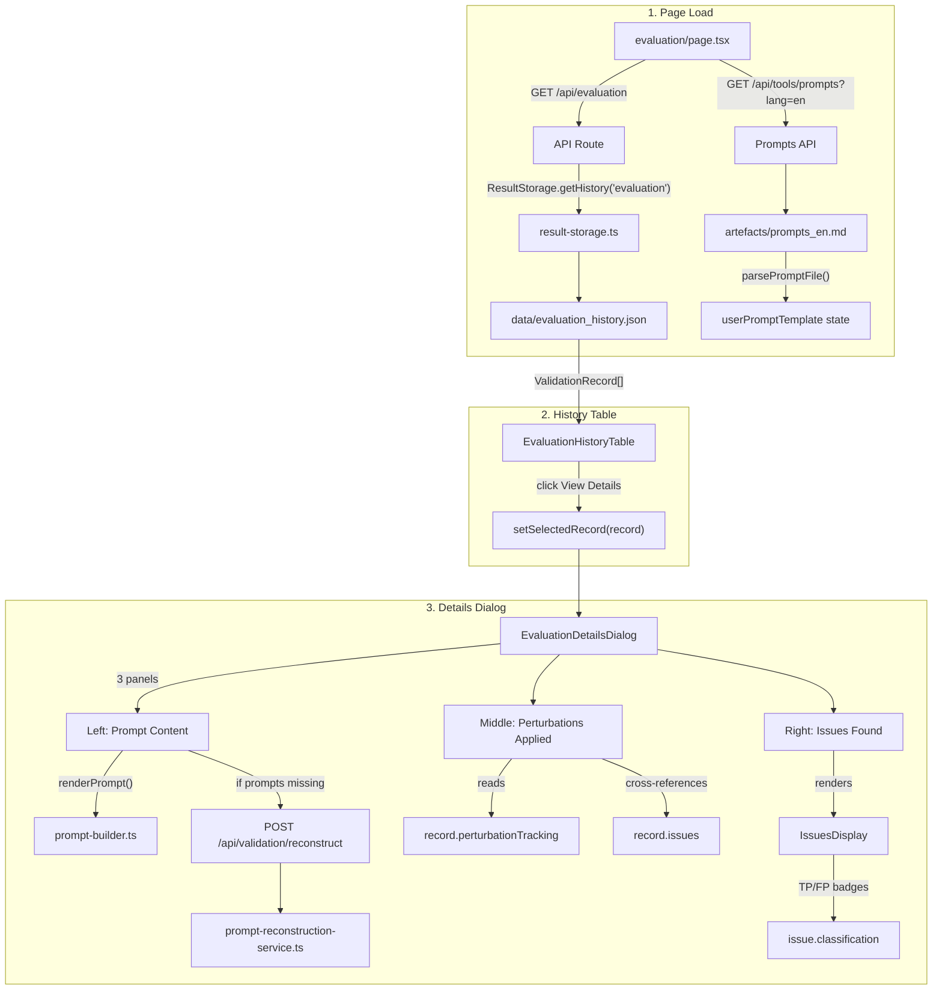

# Evaluation History — View Details Flow

From **clicking "View Details"** on a past evaluation → **fetching the record from storage** → **displaying in the details modal**.

---

## Flow Overview



---

## All Files Involved

### 1. Page & History Table

| File | Path | Role |
|------|------|------|
| **Page** | [page.tsx](file:///home/maxencetlm/Bill-LLM-EndVal/validation-studio/src/app/evaluation/page.tsx) | Fetches evaluation history + prompt template on load. Manages `selectedRecord` state. Passes `userPromptTemplate` to the details dialog. |
| **EvaluationHistoryTable** | [evaluation-history-table.tsx](file:///home/maxencetlm/Bill-LLM-EndVal/validation-studio/src/components/evaluation/evaluation-history-table.tsx) | Renders records in a table (date, event name, ID, status, issue count). "View Details" button triggers `onSelectRecord(record)`. |

---

### 2. Details Dialog (the core of this flow)

| File | Path | Role |
|------|------|------|
| **EvaluationDetailsDialog** | [evaluation-details-dialog.tsx](file:///home/maxencetlm/Bill-LLM-EndVal/validation-studio/src/components/evaluation/evaluation-details-dialog.tsx) | Full-screen 3-panel dialog. **Header:** event name, ID, timestamp, global precision/recall metrics. **Controls:** module selector tabs, per-module metrics, prompt pagination. **Left panel:** prompt content with line highlighting. **Middle panel:** perturbation tracking with found/not-found status and filters. **Right panel:** issues with TP/FP classification filter. |
| **IssuesDisplay** | [issues-display.tsx](file:///home/maxencetlm/Bill-LLM-EndVal/validation-studio/src/components/validation/issues-display.tsx) | Renders individual issues with severity icons, path, message, suggestion, TP/FP badge. Supports `highlightedPath` for cross-referencing with perturbations. Auto-scrolls to highlighted issue. |

---

### 3. API Routes

| File | Path | Role |
|------|------|------|
| **Evaluation CRUD** | [api/evaluation/route.ts](file:///home/maxencetlm/Bill-LLM-EndVal/validation-studio/src/app/api/evaluation/route.ts) | `GET` — returns `ResultStorage.getHistory('evaluation')` sorted by date desc. `DELETE` — removes record by ID. |
| **Prompts API** | [api/tools/prompts/route.ts](file:///home/maxencetlm/Bill-LLM-EndVal/validation-studio/src/app/api/tools/prompts/route.ts) | `GET` — reads `artefacts/prompts_en.md`, returns raw content for template parsing. |
| **Reconstruct API** | [api/validation/reconstruct/route.ts](file:///home/maxencetlm/Bill-LLM-EndVal/validation-studio/src/app/api/validation/reconstruct/route.ts) | `POST` — reconstructs prompts when record has none stored. Only called as fallback. |

---

### 4. Backend Services (conditional — prompt reconstruction only)

| File | Path | Role |
|------|------|------|
| **PromptReconstructionService** | [prompt-reconstruction-service.ts](file:///home/maxencetlm/Bill-LLM-EndVal/validation-studio/src/lib/validation/orchestrator-modules/prompt-reconstruction-service.ts) | `reconstructPrompts()` — re-fetches events and rebuilds prompts. |
| **Bill API** | [bill-api.ts](file:///home/maxencetlm/Bill-LLM-EndVal/validation-studio/src/lib/api/bill-api.ts) | `getTsApi(eventId)` — fetches full event JSON for reconstruction. |
| **DataPreparation** | [data-preparation.ts](file:///home/maxencetlm/Bill-LLM-EndVal/validation-studio/src/lib/validation/orchestrator-modules/data-preparation.ts) | Transforms events into CSV comparison strings. |
| **PromptProcessor** | [prompt-processor.ts](file:///home/maxencetlm/Bill-LLM-EndVal/validation-studio/src/lib/validation/orchestrator-modules/prompt-processor.ts) | Applies perturbation/slicing to prompts. |
| **module-contribution** | [module-contribution.ts](file:///home/maxencetlm/Bill-LLM-EndVal/validation-studio/src/lib/validation/module-contribution.ts) | Extracts module data from event JSON. |
| **format_csv_comparison** | [format_csv_comparison.ts](file:///home/maxencetlm/Bill-LLM-EndVal/validation-studio/src/lib/validation/format_csv_comparison.ts) | Builds comparison tables. |

---

### 5. Shared Utilities

| File | Path | Role |
|------|------|------|
| **Prompt Builder** | [prompt-builder.ts](file:///home/maxencetlm/Bill-LLM-EndVal/validation-studio/src/lib/validation/prompt-builder.ts) | `parsePromptFile()` — extracts template on page load. `renderPrompt()` — formats raw prompt data for display in the dialog. |
| **ResultStorage** | [result-storage.ts](file:///home/maxencetlm/Bill-LLM-EndVal/validation-studio/src/lib/validation/orchestrator-modules/result-storage.ts) | `getHistory('evaluation')` / `deleteRecord()` — reads/writes `evaluation_history.json`. |
| **storage-core** | [storage-core.ts](file:///home/maxencetlm/Bill-LLM-EndVal/validation-studio/src/lib/configuration/storage-core.ts) | `ValidationRecord` interface — includes `perturbationTracking`, `metrics`, `moduleMetrics`. |

---

### 6. Static Assets

| File | Path | Role |
|------|------|------|
| **Prompt Template** | `artefacts/prompts_en.md` | LLM prompt template for display rendering. |
| **Data File** | `data/evaluation_history.json` | Persisted evaluation records. |

---

## The 3-Panel Dialog Layout

```
┌──────────────────────────────────────────────────────────────────────────────────┐
│  Header: Event Name | ID | Timestamp | Precision: XX% | Recall: XX%    [Close] │
├──────────────────────────────────────────────────────────────────────────────────┤
│  Module Tabs: [Event] [EventDates] [OwnerPOS] ...  │ Module Precision / Recall  │
│  ← Prompt 1 of N →                                                             │
├──────────────────┬───────────────────────┬───────────────────────────────────────┤
│  Prompt Content  │  Perturbations (N)    │  Issues Found (N)                    │
│  (30%)          │  (30%)               │  (40%)                               │
│                  │  [Filter: All/Found/  │  [Filter: All/TP/FP]                │
│  Line-by-line    │   Not-found]          │                                     │
│  with highlight  │                       │  ┌─ Issue 1 ──────────────────┐     │
│                  │  ┌─ path.to.field ─┐  │  │ path.to.field    [TP] err │     │
│  ██████████████  │  │ "old" → "new"   │  │  │ Description text         │     │
│  ██████████████  │  │          [Found] │  │  │ Suggestion: ...          │     │
│  ██████████████  │  └─────────────────┘  │  └────────────────────────────┘     │
│                  │                       │                                     │
│  Click perturb → │  Click path →         │  Cross-referenced with              │
│  highlights line │  highlights prompt    │  perturbation paths                 │
│                  │  + scrolls to issue   │                                     │
└──────────────────┴───────────────────────┴───────────────────────────────────────┘
```

---

## Key Interactions

### Cross-Referencing (Perturbation ↔ Issue)
1. User clicks a perturbation path → `findLineForPath()` highlights the corresponding line in the prompt panel and scrolls to it
2. If the perturbation was detected (found), `highlightedIssuePath` is set → `IssuesDisplay` auto-scrolls to and highlights the matching issue
3. Each perturbation shows "Found" (green) or "Not found" (gray) based on whether any issue path matches

### Filtering
- **Perturbation filter** (middle panel): All / Found / Not-found — filters perturbation list by detection status
- **Classification filter** (right panel): All / TP / FP — filters issues by classification

### Prompt Reconstruction (Fallback)
Triggered only when `record.prompts` is empty but `record.targetEventId` and `record.referenceIds` exist. Calls `POST /api/validation/reconstruct` to rebuild prompts from source event data.

---

## Data Shape in `ValidationRecord`

The following fields from the stored record are used by the details dialog:

```typescript
{
  // Header
  eventName: string
  eventId: number
  timestamp: string
  metrics: { precision: number, recall: number, tp: number, fp: number, fn: number }
  moduleMetrics: Record<string, { precision: number, recall: number }>

  // Prompt Panel
  prompts: Record<string, string | string[]>  // module → prompt(s)

  // Perturbation Panel
  perturbationTracking: Record<string, Array<{
    index: number
    details: Array<{ path: string, original: string, perturbed: string }>
  }>>

  // Issues Panel
  issues: Array<{
    path: string, severity: string, message: string,
    suggestion?: string, module?: string,
    classification?: 'TP' | 'FP', itemIndex?: number
  }>
}
```

---

## Total File Count: **17 files** involved in the evaluation history details flow

| Layer | Count | Files |
|-------|-------|-------|
| Page & UI | 4 | `page.tsx`, `evaluation-history-table.tsx`, `evaluation-details-dialog.tsx`, `issues-display.tsx` |
| API Routes | 3 | `api/evaluation/route.ts`, `api/tools/prompts/route.ts`, `api/validation/reconstruct/route.ts` |
| Reconstruction (conditional) | 6 | `prompt-reconstruction-service.ts`, `bill-api.ts`, `data-preparation.ts`, `prompt-processor.ts`, `module-contribution.ts`, `format_csv_comparison.ts` |
| Shared Utilities | 3 | `prompt-builder.ts`, `result-storage.ts`, `storage-core.ts` |
| Static Assets | 2 | `artefacts/prompts_en.md`, `data/evaluation_history.json` |
