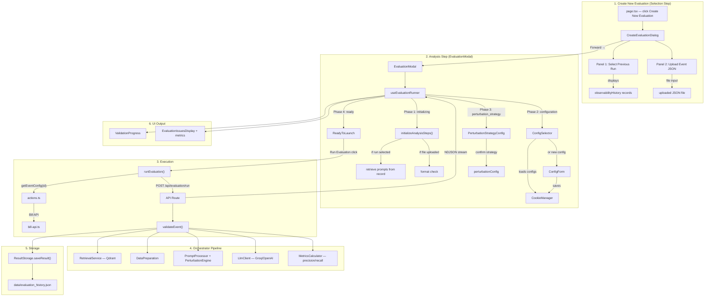

# Evaluation Page — Full File Chain

From **clicking "Create New Evaluation"** → through **wizard phases** → to **storage**.

---

## Flow Overview

---

## Wizard Flow (Step by Step)

The evaluation wizard progresses through **6 phases**, managed by `useEvaluationRunner`:

| Phase | UI Component | What Happens |
|-------|-------------|-------------|
| **selection** | `CreateEvaluationDialog` | User picks a previous validation run OR uploads a JSON file. Clicks "Forward →". |
| **initializing** | Loader spinner | If run selected: retrieves prompts from `observabilityHistory`. If file: format check. Engine initialized. |
| **configuration** | `ConfigSelector` | User selects an LLM config (from cookies) or creates a new one via `ConfigForm`. |
| **perturbation_strategy** | `PerturbationStrategyConfig` | User configures which modules to perturb, percentage ranges, attribute types. |
| **ready** | `ReadyToLaunch` | "Run Evaluation" button enabled. |
| **running** → **complete** | `ValidationProgress` → `EvaluationIssuesDisplay` | Streams results from server. Shows issues + precision/recall metrics on completion. |

---

## All Files Involved (in execution order)

### 1. Page & Wizard UI

| File | Path | Role |
|------|------|------|
| **Page** | [page.tsx](file:///home/maxencetlm/Bill-LLM-EndVal/validation-studio/src/app/evaluation/page.tsx) | Main evaluation page. Fetches evaluation + observability history on load. Renders `EvaluationHistoryTable`, `EvaluationDetailsDialog`, `CreateEvaluationDialog`. "Create New Evaluation" button opens the wizard. |
| **CreateEvaluationDialog** | [create-evaluation-dialog.tsx](file:///home/maxencetlm/Bill-LLM-EndVal/validation-studio/src/components/evaluation/create-evaluation-dialog.tsx) | Two-step wizard dialog. **Step 1 (selection):** left panel lists past validation runs, right panel allows JSON upload. **Step 2 (analysis):** renders `EvaluationModal`. Handles `onRunEvaluation` — either parses the uploaded file or calls `getEventConfig(id)` to fetch event data. |
| **EvaluationModal** | [evaluation-modal.tsx](file:///home/maxencetlm/Bill-LLM-EndVal/validation-studio/src/components/evaluation/evaluation-modal.tsx) | Layout for the analysis step. Left panel: `ValidationProgress`. Right panel: phase-dependent content (`ConfigSelector` / `PerturbationStrategyConfig` / `ReadyToLaunch` / `EvaluationIssuesDisplay`). Footer: "Run Evaluation" / "Finish" button. |
| **ConfigSelector** | [config-selector.tsx](file:///home/maxencetlm/Bill-LLM-EndVal/validation-studio/src/components/evaluation/config-selector.tsx) | Displays available LLM configurations as cards. User clicks to select one. "New Config" button opens `ConfigForm`. |
| **PerturbationStrategyConfig** | [perturbation-strategy-config.tsx](file:///home/maxencetlm/Bill-LLM-EndVal/validation-studio/src/components/evaluation/perturbation-strategy-config.tsx) | Configures perturbation strategy: module selection (all/custom), percentage ranges per module, attribute type filters (String, Integer, Float, Boolean, Date, UUID). Outputs `PerturbationConfig`. |
| **ReadyToLaunch** | [ready-to-launch.tsx](file:///home/maxencetlm/Bill-LLM-EndVal/validation-studio/src/components/evaluation/ready-to-launch.tsx) | Static "Ready to Launch" confirmation screen. |
| **EvaluationHistoryTable** | [evaluation-history-table.tsx](file:///home/maxencetlm/Bill-LLM-EndVal/validation-studio/src/components/evaluation/evaluation-history-table.tsx) | Renders past evaluation records in a table (date, event name, status, issues count, view/delete actions). |
| **EvaluationIssuesDisplay** | [evaluation-issues-display.tsx](file:///home/maxencetlm/Bill-LLM-EndVal/validation-studio/src/components/evaluation/evaluation-issues-display.tsx) | Shows evaluation results: issues list grouped by severity + metrics dashboard (precision, recall, TP, FP, FN). |
| **ConfigForm** | [config-form.tsx](file:///home/maxencetlm/Bill-LLM-EndVal/validation-studio/src/components/configuration/config-form.tsx) | Form for creating/editing LLM configurations (model, temperature, references, slicing). Uses Zod validation. |

---

### 2. Hooks & Client Logic

| File | Path | Role |
|------|------|------|
| **useEvaluationRunner** | [useEvaluationRunner.ts](file:///home/maxencetlm/Bill-LLM-EndVal/validation-studio/src/hooks/useEvaluationRunner.ts) | Central hook managing all 6 phases. `loadConfigs()` — reads from CookieManager + fetches prompts. `initializeAnalysisSteps()` — sets up progress steps. `handleConfigSelect()` / `handleStrategyConfirm()` — advance phases. `runEvaluation()` — calls `POST /api/evaluation/run` with streaming, processes NDJSON for progress/result/error. |
| **CookieManager** | [cookie-manager.ts](file:///home/maxencetlm/Bill-LLM-EndVal/validation-studio/src/lib/configuration/cookie-manager.ts) | Reads/writes `llm_configurations` cookie for LLM configs. |
| **Server Actions** | [actions.ts](file:///home/maxencetlm/Bill-LLM-EndVal/validation-studio/src/app/actions.ts) | `getEventConfig(id)` — fetches full event JSON from Bill API. Called when a previous run is selected (to get fresh event data). |

---

### 3. API Routes

| File | Path | Role |
|------|------|------|
| **Evaluation Run** | [run/route.ts](file:///home/maxencetlm/Bill-LLM-EndVal/validation-studio/src/app/api/evaluation/run/route.ts) | `POST` — shared with validation. Receives `{ targetEvent, config, perturbationConfig }`. Creates `ReadableStream`, calls `validateEvent()`, streams NDJSON progress + final result (issues, prompts, metrics). |
| **Evaluation CRUD** | [route.ts](file:///home/maxencetlm/Bill-LLM-EndVal/validation-studio/src/app/api/evaluation/route.ts) | `GET` — returns `ResultStorage.getHistory('evaluation')` sorted by date. `POST` — saves a new evaluation record. `DELETE` — removes by ID. |
| **Observability CRUD** | [api/observability/route.ts](file:///home/maxencetlm/Bill-LLM-EndVal/validation-studio/src/app/api/observability/route.ts) | `GET` — fetches validation history (used to populate the "Select Previous Run" panel). |
| **Prompts API** | [api/tools/prompts/route.ts](file:///home/maxencetlm/Bill-LLM-EndVal/validation-studio/src/app/api/tools/prompts/route.ts) | `GET` — reads `artefacts/prompts_en.md` for prompt templates. |

---

### 4. Orchestrator Pipeline (Server-Side)

| File | Path | Role |
|------|------|------|
| **Orchestrator** | [validation-orchestrator.ts](file:///home/maxencetlm/Bill-LLM-EndVal/validation-studio/src/lib/validation/validation-orchestrator.ts) | `validateEvent()` — the main pipeline. When `perturbationConfig` is provided, the `PromptProcessor` applies perturbations. Loops over 7 modules. |
| **RetrievalService** | [retrieval-service.ts](file:///home/maxencetlm/Bill-LLM-EndVal/validation-studio/src/lib/validation/orchestrator-modules/retrieval-service.ts) | Queries Qdrant for similar events. Uses `getTsApi()` to fetch each reference. |
| **Bill API** | [bill-api.ts](file:///home/maxencetlm/Bill-LLM-EndVal/validation-studio/src/lib/api/bill-api.ts) | `getTsApi(eventId)` — fetches full event JSON. Used by RetrievalService and actions.ts. |
| **DataPreparation** | [data-preparation.ts](file:///home/maxencetlm/Bill-LLM-EndVal/validation-studio/src/lib/validation/orchestrator-modules/data-preparation.ts) | Transforms target + reference events into CSV comparison strings per module. |
| **PromptProcessor** | [prompt-processor.ts](file:///home/maxencetlm/Bill-LLM-EndVal/validation-studio/src/lib/validation/orchestrator-modules/prompt-processor.ts) | Applies perturbations (via `PerturbationEngine`) and slicing. When `perturbationConfig` is present, uses `injectPerturbationsWithTracking()` for metrics. |
| **PerturbationEngine** | [perturbation-engine.ts](file:///home/maxencetlm/Bill-LLM-EndVal/validation-studio/src/lib/evaluation/perturbation-engine.ts) | Core engine that injects perturbations into prompt data. `injectPerturbationsWithTracking()` — parses the TARGET column from the CSV table, mutates values by type (String, Integer, Float, Boolean, Date, UUID), returns perturbed prompt + list of affected paths (for precision/recall). |
| **module-contribution** | [module-contribution.ts](file:///home/maxencetlm/Bill-LLM-EndVal/validation-studio/src/lib/validation/module-contribution.ts) | Extracts module-specific data from event JSON. |
| **format_csv_comparison** | [format_csv_comparison.ts](file:///home/maxencetlm/Bill-LLM-EndVal/validation-studio/src/lib/validation/format_csv_comparison.ts) | Builds PATH/TARGET/REF comparison tables. |
| **Prompt Builder** | [prompt-builder.ts](file:///home/maxencetlm/Bill-LLM-EndVal/validation-studio/src/lib/validation/prompt-builder.ts) | `parsePromptFile()` + `renderPrompt()` — template parsing and injection. |
| **LlmClient** | [llm-client.ts](file:///home/maxencetlm/Bill-LLM-EndVal/validation-studio/src/lib/validation/llm-client.ts) | Calls LLM API (Groq/OpenAI) with constructed prompts. Returns parsed issues. |
| **MetricsCalculator** | [metrics-calculator.ts](file:///home/maxencetlm/Bill-LLM-EndVal/validation-studio/src/lib/validation/orchestrator-modules/metrics-calculator.ts) | Computes precision, recall, TP, FP, FN from perturbation tracking data (which paths were perturbed vs. which the LLM flagged). |

---

### 5. Storage

| File | Path | Role |
|------|------|------|
| **ResultStorage** | [result-storage.ts](file:///home/maxencetlm/Bill-LLM-EndVal/validation-studio/src/lib/validation/orchestrator-modules/result-storage.ts) | `saveResult()` — constructs record and writes it. Uses `type='evaluation'` to write to the evaluation file. CRUD methods for history. |
| **storage-core** | [storage-core.ts](file:///home/maxencetlm/Bill-LLM-EndVal/validation-studio/src/lib/configuration/storage-core.ts) | Defines `ValidationRecord` interface (shared across validation and evaluation). |
| **Data File** | `data/evaluation_history.json` | Persisted evaluation records with issues, prompts, perturbation tracking, and metrics. |

---

## Key Difference from Validation Flow

| Aspect | Validation | Evaluation |
|--------|-----------|------------|
| **Input** | Search bar or JSON upload directly | Select a previous validation run OR upload JSON |
| **Perturbation** | No perturbation (`perturbationConfig: null`) | User configures perturbation strategy via `PerturbationStrategyConfig` |
| **Engine** | No `PerturbationEngine` | `PerturbationEngine.injectPerturbationsWithTracking()` modifies prompt data |
| **Metrics** | None | `MetricsCalculator` computes precision/recall from perturbation tracking |
| **Storage file** | `validation_history.json` | `evaluation_history.json` |
| **API Route** | `POST /api/evaluation/run` with `storageType: 'validation'` | `POST /api/evaluation/run` (default `storageType: 'evaluation'`) |

---

## Total File Count: **25 files** involved in the evaluation flow

| Layer | Count | Files |
|-------|-------|-------|
| Page & Wizard UI | 9 | `page.tsx`, `create-evaluation-dialog.tsx`, `evaluation-modal.tsx`, `config-selector.tsx`, `perturbation-strategy-config.tsx`, `ready-to-launch.tsx`, `evaluation-history-table.tsx`, `evaluation-issues-display.tsx`, `config-form.tsx` |
| Hooks & Client Logic | 3 | `useEvaluationRunner.ts`, `cookie-manager.ts`, `actions.ts` |
| API Routes | 4 | `api/evaluation/run/route.ts`, `api/evaluation/route.ts`, `api/observability/route.ts`, `api/tools/prompts/route.ts` |
| Orchestrator Pipeline | 11 | `validation-orchestrator.ts`, `retrieval-service.ts`, `bill-api.ts`, `data-preparation.ts`, `prompt-processor.ts`, `perturbation-engine.ts`, `module-contribution.ts`, `format_csv_comparison.ts`, `prompt-builder.ts`, `llm-client.ts`, `metrics-calculator.ts` |
| Storage | 2 | `result-storage.ts`, `storage-core.ts` |
