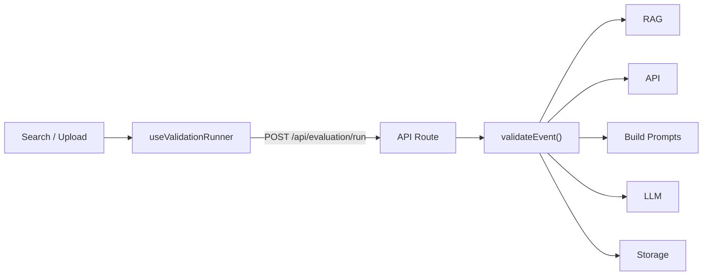
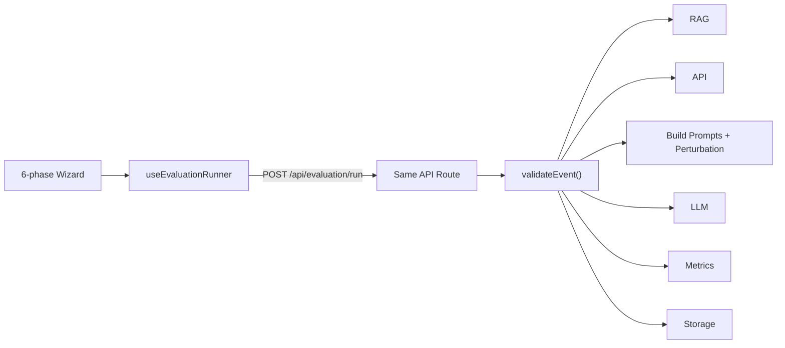
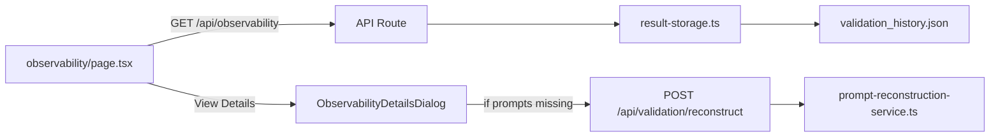
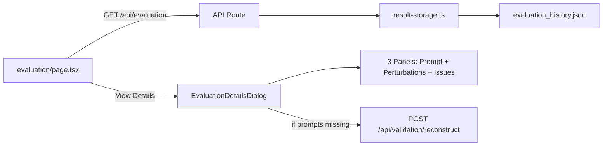
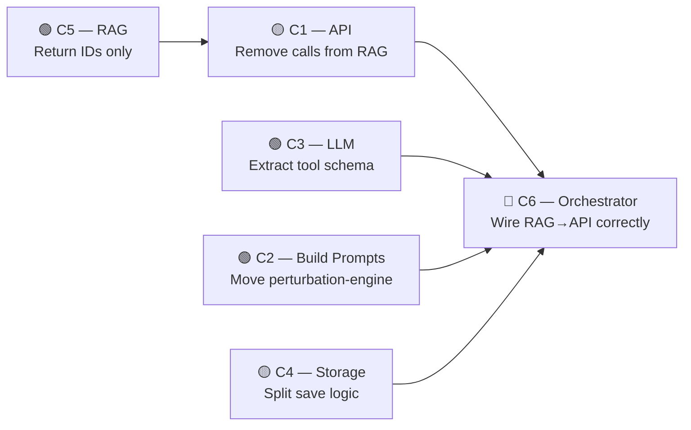

# Compartment Migration Strategy

> **Goal**: Migrate towards the **View ↔ Orchestrator ↔ Backend** architecture described in `backend-architecture.md`, enforcing clean boundaries for each of the 6 compartments.

---

## Current State of the 4 Main Processes

### 1. Validation (20 files)

**Trigger**: User enters an event ID or uploads JSON → clicks "Start Validation".



| Aspect | Current State |
|--------|--------------|
| **Entry point** | `useValidationRunner.ts` calls `POST /api/evaluation/run` with `storageType: 'validation'` |
| **API Route** | `api/evaluation/run/route.ts` — **shared** with Evaluation, thin wrapper around `validateEvent()` |
| **Orchestrator** | `validation-orchestrator.ts` → `validateEvent()` — monolithic 200-line function that directly calls RAG, API, Build Prompts, LLM, Metrics, and Storage |
| **Build Prompts** | ✅ Already well-factored via `shared-prompt-pipeline.ts` → `buildPromptsForModule()` |
| **LLM** | `llm-client.ts` — stateless, but tool-call schema is **hardcoded inside the orchestrator**, not in the LLM compartment |
| **Storage** | `result-storage.ts` — writes to `data/validation_history.json` |
| **RAG** | `retrieval-service.ts` — clean interface, but coupled (API calls to fetch events inside RAG) |

> [!WARNING]
> The orchestrator mixes concerns: it defines the LLM tool schema inline, handles progress streaming, and manages storage — all inside a single function.

---

### 2. Evaluation (25 files)

**Trigger**: User selects a previous validation run or uploads JSON → configures perturbation strategy → clicks "Run Evaluation".



| Aspect | Current State |
|--------|--------------|
| **Entry point** | `useEvaluationRunner.ts` — manages 6 wizard phases (selection → config → perturbation → ready → running → complete) |
| **API Route** | Same `api/evaluation/run/route.ts` as Validation |
| **Orchestrator** | Same `validateEvent()` — branching on `perturbationConfig` presence |
| **Perturbation** | `perturbation-engine.ts` — invoked through `PromptProcessor`, clean but in `src/lib/evaluation/` instead of Build Prompts |
| **Metrics** | `metrics-calculator.ts` — computes TP/FP/FN precision/recall, only used in evaluation mode |
| **Storage** | Same `result-storage.ts` → writes to `data/evaluation_history.json` |

> [!NOTE]
> Evaluation and Validation share the exact same orchestrator function and API route. The only differences are the presence of `perturbationConfig` and `storageType`. This is good for reuse but blurs compartment boundaries.

---

### 3. Observability (Validation History) (15 files)

**Trigger**: User opens Observability page → clicks "View Details" on a past validation record.



| Aspect | Current State |
|--------|--------------|
| **Page** | `observability/page.tsx` — fetches history + prompt template on load |
| **Dialog** | `observability-details-dialog.tsx` — 2-panel (prompt + issues) |
| **Reconstruction** | `prompt-reconstruction-service.ts` — re-fetches events via Bill API, rebuilds prompts through Build Prompts pipeline. **Uses the same `buildPromptsForModule()`** ✅ |
| **API Routes** | 3 routes: CRUD (`/api/observability`), prompts (`/api/tools/prompts`), reconstruct (`/api/validation/reconstruct`) |

> [!IMPORTANT]
> Process 6.2 from the architecture doc. Reconstruction divergence risk: if Build Prompts logic changes between original run and reconstruction, displayed prompts may differ from what was sent.

---

### 4. Evaluation History (17 files)

**Trigger**: User opens Evaluation page → clicks "View Details" on a past evaluation record.



| Aspect | Current State |
|--------|--------------|
| **Page** | `evaluation/page.tsx` — fetches both evaluation AND observability history |
| **Dialog** | `evaluation-details-dialog.tsx` — **3-panel** (prompt + perturbations + issues with TP/FP) |
| **Metrics** | Global precision/recall in header + per-module metrics in tabs |
| **Cross-referencing** | Perturbation ↔ Issue linking with click-to-highlight |
| **Reconstruction** | Same `prompt-reconstruction-service.ts` as Observability |

---

## Migration Strategy by Compartment

### Compartment 1 — API

> **Target**: Pure I/O layer. Receives an `eventId`, returns raw JSON. No transformation.

| Item | Status | Migration Task |
|------|--------|---------------|
| `bill-api.ts` → `getTsApi(eventId)` | ✅ Clean | Already isolated in `src/lib/api/bill-api.ts` |
| Called by `RetrievalService` | ⚠️ Coupled | RAG compartment calls `getTsApi()` to fetch each similar event. Move this responsibility to the **Orchestrator** — RAG should return IDs only, then Orchestrator calls API for each |
| Called by `actions.ts` | ⚠️ Coupled | Server actions call `getTsApi()` directly from the View layer. Route through Orchestrator instead |
| Called by `prompt-reconstruction-service.ts` | ⚠️ Coupled | Reconstruction service fetches events directly. Route through Orchestrator |

#### Migration Steps

```
[ ] 1.1 — Keep `bill-api.ts` as-is (it's already a clean compartment)
[ ] 1.2 — Remove `getTsApi()` calls from `retrieval-service.ts` →
         RAG returns `number[]` only, Orchestrator fetches event JSONs
[ ] 1.3 — Remove direct `getTsApi()` calls from `actions.ts` →
         Create an API route that proxies through the API compartment
[ ] 1.4 — Remove `getTsApi()` from `prompt-reconstruction-service.ts` →
         Orchestrator 6.2 passes pre-fetched events
[ ] 1.5 — Define explicit contract:
         Input:  eventId: number
         Output: Promise<any> (full event JSON)
```

---

### Compartment 2 — Build Prompts

> **Target**: Pure data transformation. Receives event JSONs + config, returns prompts. No I/O.

| Item | Status | Migration Task |
|------|--------|---------------|
| `shared-prompt-pipeline.ts` | ✅ Clean | Already the unified entry point for both Validation and Reconstruction |
| `module-contribution.ts` | ✅ Clean | Pure extraction, no I/O |
| `format_csv_comparison.ts` | ✅ Clean | Pure formatting, no I/O |
| `data-preparation.ts` | ✅ Clean | Data transformation only |
| `prompt-processor.ts` | ✅ Clean | Perturbation + slicing orchestration |
| `perturbation-engine.ts` | ⚠️ Location | Lives in `src/lib/evaluation/` instead of under Build Prompts. Logically belongs here |
| `prompt-builder.ts` | ✅ Clean | Template parsing + rendering |
| Tool-call schema | ❌ Wrong place | Defined **inside** `validation-orchestrator.ts` (lines 120–140). Should be in LLM compartment |

#### Migration Steps

```
[ ] 2.1 — Move `perturbation-engine.ts` from `src/lib/evaluation/` to
         `src/lib/validation/` (or a new `src/lib/build-prompts/` directory)
[ ] 2.2 — Extract the LLM tool-call schema from `validation-orchestrator.ts`
         into the LLM compartment (see Compartment 3)
[ ] 2.3 — Consider renaming `src/lib/validation/` to `src/lib/build-prompts/`
         to match compartment naming (optional, but clarifies intent)
[ ] 2.4 — Verify pure-function contract:
         Input:  { targetEvent, similarEvents[], config, perturbationStrategy? }
         Output: Record<module, BuiltPrompt[]>
```

---

### Compartment 3 — LLM

> **Target**: Stateless. One prompt in, one structured result out. No business logic.

| Item | Status | Migration Task |
|------|--------|---------------|
| `llm-client.ts` → `validateSection()` | ✅ Mostly clean | Stateless, handles retry/fallback |
| Tool-call schema | ❌ Defined in orchestrator | The `report_step_issues` tool definition is hardcoded in `validateEvent()`, not in the LLM compartment |
| Error handling | ⚠️ Split | Rate-limit handling is in the orchestrator's catch block, not in the LLM client |
| Model/temperature config | ✅ Clean | Passed in at construction time |

#### Migration Steps

```
[ ] 3.1 — Move the `report_step_issues` tool schema into `llm-client.ts`
         as a default/exported constant
[ ] 3.2 — Have `validateSection()` accept the tool schema as a parameter
         with a sensible default (the current one)
[ ] 3.3 — Move rate-limit retry logic into LlmClient (throw a typed error
         the orchestrator can catch cleanly)
[ ] 3.4 — Define explicit contract:
         Input:  { prompt: string, config: { model, temperature } }
         Output: Promise<Issue[]>
```

---

### Compartment 4 — Storage

> **Target**: Persist and retrieve validation/evaluation records. CRUD only.

| Item | Status | Migration Task |
|------|--------|---------------|
| `result-storage.ts` | ⚠️ Mixed | `saveResult()` does record construction + persistence in one method. Should separate record building (Orchestrator) from persistence (Storage) |
| `storage-core.ts` | ✅ Clean | Defines `ValidationRecord` interface |
| API routes for CRUD | ⚠️ Scattered | 3 separate routes (`/api/observability`, `/api/evaluation`, `/api/validation/reconstruct`) each doing their own storage access |
| JSON files | ✅ OK | `validation_history.json` and `evaluation_history.json` |

#### Migration Steps

```
[ ] 4.1 — Split `ResultStorage.saveResult()` into two parts:
         a) Record construction → move to Orchestrator
         b) `ResultStorage.save(record)` → pure persistence
[ ] 4.2 — Unify storage API routes under one pattern:
         GET /api/storage/{type}        → getHistory(type)
         POST /api/storage/{type}       → saveRecord(type, record)
         DELETE /api/storage/{type}/{id} → deleteRecord(type, id)
         (or keep current routes but ensure they all delegate to the
          same Storage compartment methods)
[ ] 4.3 — Add a `getRecord(type, eventId, date)` method for single-record
         retrieval (used by Orchestrator 6.2)
[ ] 4.4 — Define explicit contract:
         save(type, record: ValidationRecord): void
         getHistory(type): ValidationRecord[]
         getRecord(type, id, date): ValidationRecord | null
         deleteRecord(type, id): void
```

---

### Compartment 5 — RAG

> **Target**: Receives event ID, returns similar event IDs. Pure vector search.

| Item | Status | Migration Task |
|------|--------|---------------|
| `retrieval-service.ts` | ⚠️ Coupled | Currently fetches events via `getTsApi()` — returns `{ similarIds, events }` instead of just `number[]` |
| Qdrant integration | ✅ Clean | Vector search is encapsulated |

#### Migration Steps

```
[ ] 5.1 — Refactor `RetrievalService.retrieveContext()` to return
         `number[]` only (list of similar event IDs)
[ ] 5.2 — Remove the `getTsApi()` import and calls from `retrieval-service.ts`
[ ] 5.3 — Update `validation-orchestrator.ts` to:
         a) Call RAG → get IDs
         b) Call API → fetch events for those IDs
         (currently step b happens inside RAG)
[ ] 5.4 — Define explicit contract:
         Input:  eventId: number, count?: number
         Output: Promise<number[]>
```

---

### Compartment 6 — Orchestrator

> **Target**: Wires compartments together. Two processes: 6.1 (Validation/Evaluation) and 6.2 (History Detail View).

| Item | Status | Migration Task |
|------|--------|---------------|
| `validation-orchestrator.ts` | ❌ Monolithic | 200-line function mixing: RAG calls, API calls, prompt building, LLM calls (with inline tool schema), progress streaming, metrics, storage, and result construction |
| `api/evaluation/run/route.ts` | ✅ Thin | Clean streaming wrapper, no business logic |
| `prompt-reconstruction-service.ts` | ⚠️ Mixed | Process 6.2 implementation but directly calls API compartment (should receive events) |
| Progress callback | ✅ OK | Clean `onProgress` callback pattern |

#### Migration Steps — Process 6.1 (Validation/Evaluation)

```
[ ] 6.1.1 — Refactor `validateEvent()` to follow the exact compartment
          call sequence:
          1. RAG → get IDs (number[])
          2. API → fetch target + similar events (parallel)
          3. Build Prompts → get prompts per module
          4. LLM → call per prompt (loop)
          5. Metrics → calculate (if evaluation)
          6. Storage → persist

[ ] 6.1.2 — Remove inline tool schema from `validateEvent()` →
          pass to LLM compartment or let it use its default

[ ] 6.1.3 — Remove record construction from `validateEvent()` →
          build the record object explicitly, then call Storage.save()

[ ] 6.1.4 — Extract common orchestration logic into a helper:
          fetchEventsForIds(ids: number[]): Promise<any[]>
          that calls API compartment for each ID
```

#### Migration Steps — Process 6.2 (History Detail View)

```
[ ] 6.2.1 — Refactor `reconstructPrompts()` to not call API directly:
          Orchestrator fetches events, then passes them to Build Prompts

[ ] 6.2.2 — Create a clear orchestrator entry point for Process 6.2:
          export async function getRecordDetails(eventId, date, type)
          that calls:
          1. Storage → get record
          2. API → re-fetch events from stored IDs
          3. Build Prompts → reconstruct prompts
          4. Return combined data

[ ] 6.2.3 — Update `/api/validation/reconstruct/route.ts` to use
          the new orchestrator function instead of calling
          `reconstructPrompts()` directly
```

---

## Implementation Priority & Dependency Order

The compartments are **not independent** — some refactors must happen before others.



### Phase 1 — Leaf Compartments (parallelizable, no dependencies)

| Priority | Compartment | Effort | Key Change |
|----------|-------------|--------|------------|
| 1a | **C5 — RAG** | 🟢 Small | Remove `getTsApi()`, return `number[]` only |
| 1b | **C3 — LLM** | 🟢 Small | Move tool schema into `llm-client.ts` |
| 1c | **C2 — Build Prompts** | 🟢 Small | Move `perturbation-engine.ts` to correct location |

### Phase 2 — Data Layer

| Priority | Compartment | Effort | Key Change |
|----------|-------------|--------|------------|
| 2a | **C1 — API** | 🟡 Medium | Remove direct calls from non-orchestrator code |
| 2b | **C4 — Storage** | 🟡 Medium | Split `saveResult()`, optionally unify routes |

### Phase 3 — Core Refactor

| Priority | Compartment | Effort | Key Change |
|----------|-------------|--------|------------|
| 3 | **C6 — Orchestrator** | 🔴 Large | Rewrite `validateEvent()` as a clean pipeline of compartment calls; create `getRecordDetails()` for Process 6.2 |

---

## Post-Migration Verification

| Check | How to Verify |
|-------|--------------|
| **Validation still works** | Run a validation for a known event ID, confirm issues match previous output |
| **Evaluation still works** | Run an evaluation with perturbation, confirm metrics (precision/recall) are computed |
| **History views work** | Open Observability and Evaluation history, click "View Details", confirm prompts render |
| **Prompt reconstruction works** | Delete prompts from a stored record, confirm reconstruction fallback triggers and displays correctly |
| **No compartment boundary violations** | `grep` for cross-compartment imports: RAG should not import API, Build Prompts should not import LLM, etc. |
| **Streaming still works** | Confirm NDJSON progress updates display correctly during a validation run |
