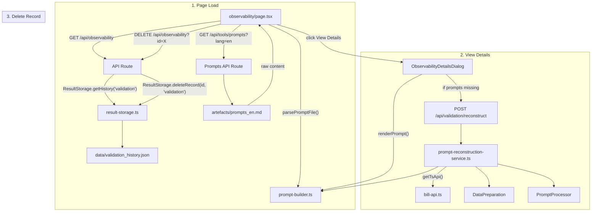

# Observability Page — Full File Chain

From **loading history** → **viewing details & prompts** → **deleting records**.

---

## Flow Overview

---

## All Files Involved (in execution order)

### 1. Page & UI Components

| File | Path | Role |
|------|------|------|
| **Page** | [page.tsx](file:///home/maxencetlm/Bill-LLM-EndVal/validation-studio/src/app/observability/page.tsx) | Main observability page. Fetches validation history on load, fetches prompt template, renders history table, opens details dialog on row click. Handles record deletion. |
| **DetailsDialog** | [observability-details-dialog.tsx](file:///home/maxencetlm/Bill-LLM-EndVal/validation-studio/src/components/observability/observability-details-dialog.tsx) | Full-screen dialog showing: module sidebar, prompt content (middle panel), issues list (right panel). Auto-reconstructs prompts if missing from the record. Uses `renderPrompt()` to format raw prompt data with the template. |

---

### 2. API Routes

| File | Path | Role |
|------|------|------|
| **Observability CRUD** | [api/observability/route.ts](file:///home/maxencetlm/Bill-LLM-EndVal/validation-studio/src/app/api/observability/route.ts) | `GET` — returns all validation history via `ResultStorage.getHistory('validation')`. `POST` — saves a new validation record. `DELETE` — removes a record by ID. |
| **Prompts API** | [api/tools/prompts/route.ts](file:///home/maxencetlm/Bill-LLM-EndVal/validation-studio/src/app/api/tools/prompts/route.ts) | `GET` — reads `artefacts/prompts_en.md` (or `prompts_fr.md`) and returns raw content. Used by the page to get the user prompt template for rendering. |
| **Reconstruct API** | [api/validation/reconstruct/route.ts](file:///home/maxencetlm/Bill-LLM-EndVal/validation-studio/src/app/api/validation/reconstruct/route.ts) | `POST` — called by the details dialog when a record has no stored prompts. Delegates to `reconstructPrompts()` to re-build prompts from event data. |

---

### 3. Backend Services (Prompt Reconstruction)

These are only invoked when the details dialog needs to reconstruct prompts (i.e., stored record lacks prompt data).

| File | Path | Role |
|------|------|------|
| **PromptReconstructionService** | [prompt-reconstruction-service.ts](file:///home/maxencetlm/Bill-LLM-EndVal/validation-studio/src/lib/validation/orchestrator-modules/prompt-reconstruction-service.ts) | `reconstructPrompts()` — fetches target + reference events, builds prompts per module, applies perturbation/slicing, renders via template. Returns `Record<string, string>`. |
| **Bill API** | [bill-api.ts](file:///home/maxencetlm/Bill-LLM-EndVal/validation-studio/src/lib/api/bill-api.ts) | `getTsApi(eventId)` — fetches full event JSON from the Bill TS API for reconstruction. |
| **DataPreparation** | [data-preparation.ts](file:///home/maxencetlm/Bill-LLM-EndVal/validation-studio/src/lib/validation/orchestrator-modules/data-preparation.ts) | `prepareModuleData()` — transforms events into CSV comparison strings. |
| **PromptProcessor** | [prompt-processor.ts](file:///home/maxencetlm/Bill-LLM-EndVal/validation-studio/src/lib/validation/orchestrator-modules/prompt-processor.ts) | `processPrompts()` — applies perturbations and slicing to prompts. |
| **module-contribution** | [module-contribution.ts](file:///home/maxencetlm/Bill-LLM-EndVal/validation-studio/src/lib/validation/module-contribution.ts) | `getEventContributionForModule()` — extracts module-specific data from event JSON. |
| **format_csv_comparison** | [format_csv_comparison.ts](file:///home/maxencetlm/Bill-LLM-EndVal/validation-studio/src/lib/validation/format_csv_comparison.ts) | `formatCsvComparison()` — builds PATH/TARGET/REF comparison tables. |

---

### 4. Shared Utilities

| File | Path | Role |
|------|------|------|
| **Prompt Builder** | [prompt-builder.ts](file:///home/maxencetlm/Bill-LLM-EndVal/validation-studio/src/lib/validation/prompt-builder.ts) | `parsePromptFile()` — parses `prompts_en.md` into system message + template. `renderPrompt()` — injects comparison data into user prompt template. Used by both the page (on load) and the dialog (for display). |
| **ResultStorage** | [result-storage.ts](file:///home/maxencetlm/Bill-LLM-EndVal/validation-studio/src/lib/validation/orchestrator-modules/result-storage.ts) | `getHistory('validation')` / `saveRecord()` / `deleteRecord()` — CRUD on `validation_history.json`. |
| **storage-core** | [storage-core.ts](file:///home/maxencetlm/Bill-LLM-EndVal/validation-studio/src/lib/configuration/storage-core.ts) | Defines the `ValidationRecord` interface used across the page. |

---

### 5. Static Assets

| File | Path | Role |
|------|------|------|
| **Prompt Template** | `artefacts/prompts_en.md` | LLM system message + user prompt template. Read by the Prompts API route. |
| **Data File** | `data/validation_history.json` | Persisted validation records. Source of truth for the history table. |

---

## Total File Count: **15 files** involved in the observability flow

| Layer | Count | Files |
|-------|-------|-------|
| Page & UI | 2 | `page.tsx`, `observability-details-dialog.tsx` |
| API Routes | 3 | `api/observability/route.ts`, `api/tools/prompts/route.ts`, `api/validation/reconstruct/route.ts` |
| Reconstruction Services | 6 | `prompt-reconstruction-service.ts`, `bill-api.ts`, `data-preparation.ts`, `prompt-processor.ts`, `module-contribution.ts`, `format_csv_comparison.ts` |
| Shared Utilities | 3 | `prompt-builder.ts`, `result-storage.ts`, `storage-core.ts` |
| Static Assets | 2 | `artefacts/prompts_en.md`, `data/validation_history.json` |

---

## Key Interactions

### Loading the Page
1. `page.tsx` calls `GET /api/observability` → `ResultStorage.getHistory('validation')` → reads `validation_history.json`
2. `page.tsx` calls `GET /api/tools/prompts?lang=en` → reads `artefacts/prompts_en.md` → `parsePromptFile()` extracts the template

### Viewing a Record
1. User clicks "View Details" → opens `ObservabilityDetailsDialog` with the selected `ValidationRecord`
2. Dialog renders prompt content using `renderPrompt(rawPrompt, template, options)`
3. If record has no stored prompts (e.g., older records), dialog auto-calls `POST /api/validation/reconstruct`
4. Reconstruction fetches events via `getTsApi()`, processes through `DataPreparation` → `PromptProcessor` → `renderPrompt()`

### Deleting a Record
1. User clicks delete icon → `DELETE /api/observability?id=X` → `ResultStorage.deleteRecord(id, 'validation')`
2. UI removes the record from local state
