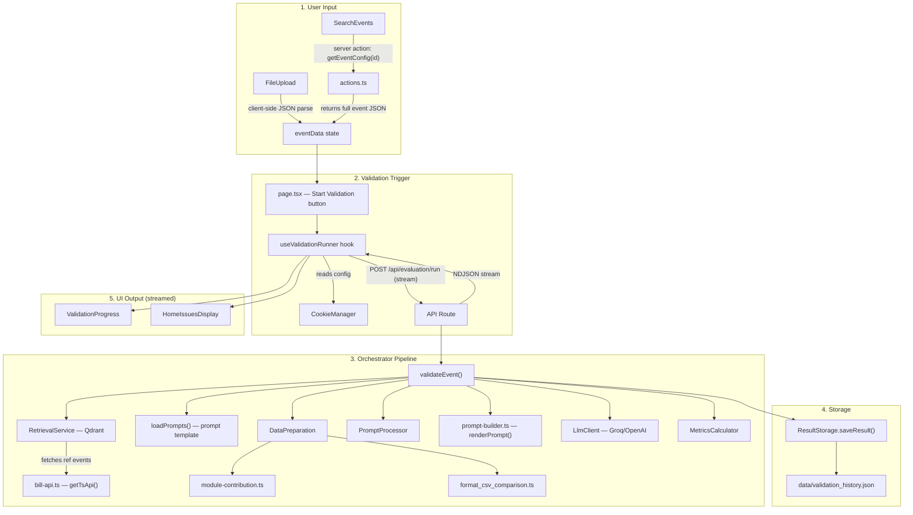

# Validation Page — Full File Chain

From **Search Bar / JSON Upload** → all the way to **Data Storage**.

---

## Flow Overview

---

## All Files Involved (in execution order)

### 1. User Input Layer

| File | Path | Role |
|------|------|------|
| **SearchEvents** | [search-events.tsx](file:///home/maxencetlm/Bill-LLM-EndVal/validation-studio/src/components/search-events.tsx) | Search bar component. Debounces user query, calls `searchEvents()` server action, then `getEventConfig(id)` on selection. |
| **Server Actions** | [actions.ts](file:///home/maxencetlm/Bill-LLM-EndVal/validation-studio/src/app/actions.ts) | `searchEvents(query)` — reads `data/events.json` and filters by name/ID. `getEventConfig(id)` — fetches full event JSON from Bill API. `refreshEventList()` — fetches all events from Bill API and caches to `data/events.json`. |
| **FileUpload** | [file-upload.tsx](file:///home/maxencetlm/Bill-LLM-EndVal/validation-studio/src/components/validation/file-upload.tsx) | Drag & drop JSON file upload. Parses JSON client-side via `FileReader`, passes parsed object up via `onFileUpload` callback. |

---

### 2. Validation Page (Main Orchestration UI)

| File | Path | Role |
|------|------|------|
| **Page** | [page.tsx](file:///home/maxencetlm/Bill-LLM-EndVal/validation-studio/src/app/page.tsx) | Main validation page. Renders `SearchEvents`, `FileUpload`, `EventPreview`, `ValidationProgress`, `HomeIssuesDisplay`. Manages `eventData` state. |
| **EventPreview** | [event-preview.tsx](file:///home/maxencetlm/Bill-LLM-EndVal/validation-studio/src/components/validation/event-preview.tsx) | Displays the loaded event JSON in a scrollable preview card. Pure display component. |
| **useValidationRunner** | [useValidationRunner.ts](file:///home/maxencetlm/Bill-LLM-EndVal/validation-studio/src/hooks/useValidationRunner.ts) | Client hook that drives the validation. Reads config from `CookieManager`, calls `POST /api/evaluation/run` with streaming, processes the NDJSON response to update UI steps and issues. |
| **CookieManager** | [cookie-manager.ts](file:///home/maxencetlm/Bill-LLM-EndVal/validation-studio/src/lib/configuration/cookie-manager.ts) | Reads `llm_configurations` cookie to get the active LLM config (model, temperature, etc). |

---

### 3. API Route

| File | Path | Role |
|------|------|------|
| **Evaluation Run** | [route.ts](file:///home/maxencetlm/Bill-LLM-EndVal/validation-studio/src/app/api/evaluation/run/route.ts) | `POST` handler. Receives `{ targetEvent, config, perturbationConfig, storageType }`. Creates a `ReadableStream`, calls `validateEvent()`, and streams progress + results back as NDJSON. |

---

### 4. Orchestrator & Pipeline Modules

| File | Path | Role |
|------|------|------|
| **Orchestrator** | [validation-orchestrator.ts](file:///home/maxencetlm/Bill-LLM-EndVal/validation-studio/src/lib/validation/validation-orchestrator.ts) | `validateEvent()` — the main pipeline. Coordinates: Retrieval → Data Prep → Prompt Processing → LLM calls → Metrics → Storage. Loops over 7 validation modules. |
| **RetrievalService** | [retrieval-service.ts](file:///home/maxencetlm/Bill-LLM-EndVal/validation-studio/src/lib/validation/orchestrator-modules/retrieval-service.ts) | Queries Qdrant vector DB for similar events. Returns `{ similarIds, events }`. Uses `getTsApi()` to fetch each reference event. |
| **Bill API** | [bill-api.ts](file:///home/maxencetlm/Bill-LLM-EndVal/validation-studio/src/lib/api/bill-api.ts) | `getTsApi(eventId)` — fetches full event JSON from the Bill TS API. Used by both RetrievalService and actions.ts. |
| **DataPreparation** | [data-preparation.ts](file:///home/maxencetlm/Bill-LLM-EndVal/validation-studio/src/lib/validation/orchestrator-modules/data-preparation.ts) | `prepareModuleData()` — transforms target + reference events into CSV-like comparison strings per module. Uses fuzzy matching for list-type modules. |
| **module-contribution** | [module-contribution.ts](file:///home/maxencetlm/Bill-LLM-EndVal/validation-studio/src/lib/validation/module-contribution.ts) | `getEventContributionForModule()` — extracts the relevant data section from an event for a given module. Returns `string` for simple modules, `string[]` for list modules (Prices, PriceGroups, RightToSellAndFees). |
| **format_csv_comparison** | [format_csv_comparison.ts](file:///home/maxencetlm/Bill-LLM-EndVal/validation-studio/src/lib/validation/format_csv_comparison.ts) | `formatCsvComparison()` — builds a PATH / TARGET / REF1 / REF2 comparison table from key-value data. |
| **PromptProcessor** | [prompt-processor.ts](file:///home/maxencetlm/Bill-LLM-EndVal/validation-studio/src/lib/validation/orchestrator-modules/prompt-processor.ts) | `processPrompts()` — applies perturbations (via `PerturbationEngine`) and slicing to the prepared CSV prompts. |
| **Prompt Builder** | [prompt-builder.ts](file:///home/maxencetlm/Bill-LLM-EndVal/validation-studio/src/lib/validation/prompt-builder.ts) | `parsePromptFile()` — parses `artefacts/prompts_en.md` into system message + template. `renderPrompt()` — injects comparison data into the user prompt template. |
| **LlmClient** | [llm-client.ts](file:///home/maxencetlm/Bill-LLM-EndVal/validation-studio/src/lib/validation/llm-client.ts) | `validateSection()` — calls the LLM API (Groq/OpenAI) with the constructed prompt + tool definitions. Returns parsed issues array. |
| **MetricsCalculator** | [metrics-calculator.ts](file:///home/maxencetlm/Bill-LLM-EndVal/validation-studio/src/lib/validation/orchestrator-modules/metrics-calculator.ts) | `calculateMetrics()` — computes precision, recall, F1 from perturbation tracking data. |

---

### 5. Storage

| File | Path | Role |
|------|------|------|
| **ResultStorage** | [result-storage.ts](file:///home/maxencetlm/Bill-LLM-EndVal/validation-studio/src/lib/validation/orchestrator-modules/result-storage.ts) | `saveResult()` — constructs the full validation record and writes it. `saveRecord()` / `getHistory()` / `deleteRecord()` — CRUD on the JSON file. |
| **storage-core** | [storage-core.ts](file:///home/maxencetlm/Bill-LLM-EndVal/validation-studio/src/lib/configuration/storage-core.ts) | Defines the `ValidationRecord` interface used across storage. |
| **Data File** | `data/validation_history.json` | The JSON file where validation results are persisted. |
| **Events Cache** | `data/events.json` | Cached event list for search (populated by `refreshEventList()`). |

---

### 6. Output Display (streamed back to client)

| File | Path | Role |
|------|------|------|
| **ValidationProgress** | [validation-progress.tsx](file:///home/maxencetlm/Bill-LLM-EndVal/validation-studio/src/components/validation/validation-progress.tsx) | Shows step-by-step validation progress with loading/success/error icons per module. |
| **HomeIssuesDisplay** | [home-issues-display.tsx](file:///home/maxencetlm/Bill-LLM-EndVal/validation-studio/src/components/validation/home-issues-display.tsx) | Displays the validation issues grouped by severity once the LLM step completes. |

---

## Static Assets

| File | Path | Role |
|------|------|------|
| **Prompt Template** | `artefacts/prompts_en.md` | The LLM system message + user prompt template file. Parsed by `prompt-builder.ts`. |

---

## Total File Count: **20 files** involved in the validation flow

| Layer | Count | Files |
|-------|-------|-------|
| User Input | 3 | `search-events.tsx`, `actions.ts`, `file-upload.tsx` |
| Validation Page UI | 4 | `page.tsx`, `event-preview.tsx`, `useValidationRunner.ts`, `cookie-manager.ts` |
| API Route | 1 | `api/evaluation/run/route.ts` |
| Orchestrator Pipeline | 10 | `validation-orchestrator.ts`, `retrieval-service.ts`, `bill-api.ts`, `data-preparation.ts`, `module-contribution.ts`, `format_csv_comparison.ts`, `prompt-processor.ts`, `prompt-builder.ts`, `llm-client.ts`, `metrics-calculator.ts` |
| Storage | 2 | `result-storage.ts`, `storage-core.ts` |
| Output Display | 2 | `validation-progress.tsx`, `home-issues-display.tsx` |
