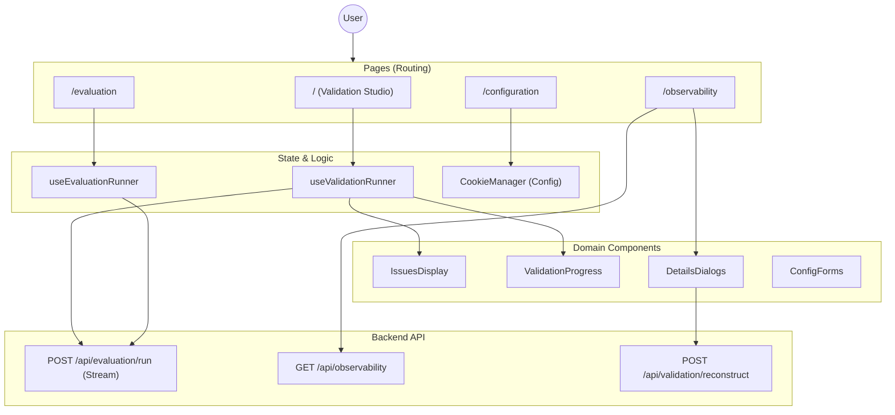

# Validation Studio — Frontend Architecture

The frontend is a data-intensive dashboard built with **Next.js 14 (App Router)**. It focuses on visualizing complex validation results, managing configuration state, and streaming real-time updates from the backend orchestrator.

---

## 1. Core Compartments

### 1.1 Runners (Orchestration Client-Side)
**Purpose**: Handle the "View <-> Orchestrator" communication. These hooks manage the complex state of a running validation process, including streaming responses and progress tracking.

| Component | Purpose | Key File |
|-----------|---------|----------|
| `useValidationRunner` | Manages the single-event validation flow on the home page. Handles the NDJSON stream specific to validation. | [useValidationRunner.ts](file:///home/maxencetlm/Bill-LLM-EndVal/validation-studio/src/hooks/useValidationRunner.ts) |
| `useEvaluationRunner` | Manages the evaluation flow (comparative/batch). Handles configuration loading and result aggregating. | [useEvaluationRunner.ts](file:///home/maxencetlm/Bill-LLM-EndVal/validation-studio/src/hooks/useEvaluationRunner.ts) |

**Interaction Pattern (Streaming)**:
1.  **POST** request to API.
2.  **Reader** attaches to `response.body`.
3.  **Loop** decodes chunks -> splits by `\n`.
4.  **Parse** each line as JSON:
    -   `type: 'progress'`: Update `ValidationProgress`.
    -   `type: 'result'`: Populate `Issues` state.
    -   `type: 'error'`: Abort and show error.

### 1.2 Configuration (State)
**Purpose**: Manage LLM hyperparameters and tool settings. Currently client-side only to allow quick iteration without user authentication complexity.

| Component | Purpose | Key File |
|-----------|---------|----------|
| `CookieManager` | Abstraction over `js-cookie`. Persists `llm_configurations` array. | [cookie-manager.ts](file:///home/maxencetlm/Bill-LLM-EndVal/validation-studio/src/lib/configuration/cookie-manager.ts) |
| `ConfigurationPage` | Tabbed view for Hyperparameters and Tools. | [page.tsx](file:///home/maxencetlm/Bill-LLM-EndVal/validation-studio/src/app/configuration/page.tsx) |

### 1.3 Views (Pages)
**Purpose**: The main interaction surfaces.

| View | Route | Description | Backend Interaction |
|------|-------|-------------|---------------------|
| **Validation** | `/` | Upload event JSON, distinct "Start" action. Shows real-time progress. | Stream `/api/evaluation/run` |
| **Observability** | `/observability` | History log. Review past runs, delete records. | CRUD `/api/observability` |
| **Evaluation** | `/evaluation` | Create scenarios, compare runs, perturbation analysis. | Mix of History APIs + Run API |
| **Configuration** | `/configuration` | Edit settings. | Local Cookies |

### 1.4 Reusable Components
**Purpose**: Shared UI logic to ensure consistency across views.

| Component | Used In | Purpose |
|-----------|---------|---------|
| `IssuesDisplay` | Validation, Evaluation | Renders the list of detected issues with severity colors and suggestions. |
| `ValidationProgress` | Validation | Visual stepper showing modules being processed (`Event`, `Prices`, etc.). |
| `ConfigForm` | Config, Evaluation | Form to create/edit LLM parameters (model, temp). |
| `DetailsDialog` | Observability, Evaluation | **(Duplicated)** complex modal showing Prompts (left) vs Issues (right). |

---

## 2. Key Data Flows

### 2.1 The Validation Run
Triggered from the Home Page.

1.  **User** uploads JSON + Clicks Start.
2.  **Hook** (`useValidationRunner`) reads Config from Cookies.
3.  **API Call** made with `{ targetEvent, config, storageType: 'validation' }`.
4.  **Stream** opens.
    -   `progress` messages update the `steps` state (loading spinners).
    -   `result` message provides the final `issues` list.
5.  **UI** updates to show "Validation Output" card with `ValidationProgress` (complete) and `IssuesDisplay`.

### 2.2 The History & Reconstruction View
Triggered from Observability or Evaluation tables.

1.  **Page** fetches list of headers (`GET`).
2.  **User** clicks "View Details".
3.  **Dialog** opens with stored metadata (Issues, Metrics).
4.  **Prompt Reconstruction**:
    -   Most records do NOT store the full prompt text to save space.
    -   Frontend calls `POST /api/validation/reconstruct` with `{ eventId, config }`.
    -   Backend re-runs the "Build Prompt" compartment.
    -   Frontend receives and displays the *reconstructed* prompt text.

---

## 3. Architecture Health & Todos

### 3.1 Code Duplication in Dialogs
**Problem**: `ObservabilityDetailsDialog` and `EvaluationDetailsDialog` share ~80% of their code (Layout, Module selector, Prompt view, Issues view).
**Risk**: Fixing a bug in one (e.g., prompt rendering) leaves the other broken.
**Todo**: Refactor into a shared `<RunDetailsView mode="observability|evaluation" />` component.

### 3.2 View <-> Orchestrator Coupling
**Status**: **Well Implemented**. The use of hooks (`useValidationRunner`) effectively decouples the View UI code from the complex streaming logic.
**Improvement**: The API contracts are implicit (JSON structure in stream). Shared TypeScript types between Frontend/Backend (in `@/types`) should be strictly enforced.

### 3.3 Configuration Storage
**Status**: **Mixed**. Cookies are convenient for single-user, but limit sharing configs between team members.
**Todo**: Move Configuration persistence to the backend (JSON file or DB) similar to History.

### 3.4 Reusable Component Upgrades
-   **Prompt Viewer**: Currently a `<pre>` block. Could be upgraded to a rich diff viewer or syntax highlighter.
-   **Issue Filter**: heavily logic-bound inside `EvaluationDetailsDialog`. Should be extracted to a hook or pure function.
